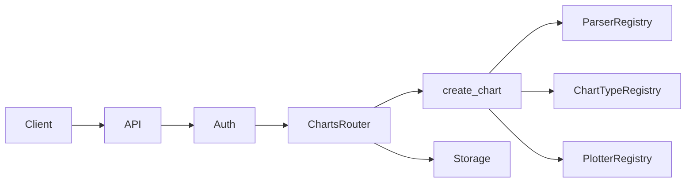

# Text-to-Chart — Developer Guide

This document helps **junior developers** understand the technology stack, templates, frameworks, system design, and how to extend or change the project. All paths are relative to the project root.

---

## Technology stack

| Layer | Technology | Where it's used |
|-------|-------------|-----------------|
| **Language** | Python 3.10+ | Entire project. See [pyproject.toml](../pyproject.toml) (`requires-python = ">=3.10"`). |
| **Data** | pandas | [chart_service/parsers/](../chart_service/parsers/), [chart_service/chart_types/](../chart_service/chart_types/); all chart logic works on DataFrames. |
| **Charts** | Plotly | [chart_service/plotters/](../chart_service/plotters/), [chart_service/exporters/](../chart_service/exporters/). Figures and templates. |
| **PNG export** | kaleido | [chart_service/exporters/image.py](../chart_service/exporters/image.py) — converts Plotly figures to PNG. |
| **REST API** | FastAPI, uvicorn, python-multipart | [api/main.py](../api/main.py), [api/routers/](../api/routers/). Routes, dependencies, file uploads. |
| **Rate limiting** | SlowAPI | [api/middleware/rate_limit.py](../api/middleware/rate_limit.py). |
| **UIs** | Streamlit | [streamlit_app/app.py](../streamlit_app/app.py), [developer_portal/app.py](../developer_portal/app.py), [admin_ui/app.py](../admin_ui/app.py). |
| **CLI** | Click | [cli.py](../cli.py) — commands and options. |
| **Validation** | Pydantic | [api/models.py](../api/models.py) — request/response models. |
| **Config** | python-dotenv, dataclasses | [config.py](../config.py) loads `.env`; `AppConfig` holds all env-based settings. |
| **Core models** | dataclasses | [chart_service/models.py](../chart_service/models.py) — `ChartConfig`, `ParsedData`. |
| **SaaS / auth** | SQLite, python-jose, passlib+bcrypt | [api/db/](../api/db/), [api/saas/](../api/saas/), [api/routers/account.py](../api/routers/account.py). usage.db, saas.db; JWT and password hashing. |
| **Optional** | openai, pytesseract, Pillow | [chart_service/llm/](../chart_service/llm/), [chart_service/parsers/image_parser.py](../chart_service/parsers/image_parser.py) — AI chart type and image-to-table. |

---

## Templates

### Chart template (Plotly)

The **chart template** controls the look of the chart (colors, fonts, grid, background). It is a Plotly template name (e.g. `plotly_white`, `plotly_dark`).

- **Defined in:** [chart_service/models.py](../chart_service/models.py) — `ChartConfig.template` (default `"plotly_white"`).
- **Applied in:** [chart_service/plotters/addons/layout.py](../chart_service/plotters/addons/layout.py) — the layout add-on calls `fig.update_layout(template=config.template)`.
- **Default from env:** [config.py](../config.py) has `default_template`, loaded from `CHART_TEMPLATE`. The API and CLI currently build `ChartConfig` via each chart type’s `get_default_config(df)`, which uses the dataclass default (`"plotly_white"`). To change the app-wide default, you can wire `config.default_template` into the place that builds `ChartConfig`, or set `template` when constructing `ChartConfig`.

**Built-in Plotly templates:** [Plotly built-in templates](https://plotly.com/python/templates/) — e.g. `plotly_white`, `plotly_dark`, `plotly_ggplot2`.

### LLM prompts

[chart_service/llm/prompts.py](../chart_service/llm/prompts.py) contains the **prompt templates** used for AI chart-type inference when `chart_type=auto` and an OpenAI key is set.

---

## Frameworks and where they are used

| Framework / tool | Where it's used | Purpose |
|------------------|-----------------|--------|
| **FastAPI** | [api/main.py](../api/main.py), [api/routers/](../api/routers/) | REST API, routes, dependencies (auth, rate limit). |
| **Streamlit** | [streamlit_app/app.py](../streamlit_app/app.py), [developer_portal/app.py](../developer_portal/app.py), [admin_ui/app.py](../admin_ui/app.py) | Three separate UIs (chart builder, developer portal, admin). |
| **Click** | [cli.py](../cli.py) | CLI commands and options (e.g. `chart --input`, `--type`). |
| **Pydantic** | [api/models.py](../api/models.py) | Request/response validation for the API. |
| **SlowAPI** | [api/middleware/rate_limit.py](../api/middleware/rate_limit.py) | Per-key rate limiting on API routes. |

---

## System design

### High-level architecture

The project is a **modular monolith**: one codebase with clear boundaries.

- **chart_service** — Core logic only. No HTTP. Parses input, chooses chart type, builds a Plotly figure. Used by the API and the CLI.
- **api** — HTTP layer: FastAPI app, auth, rate limiting, storage, usage tracking, SaaS (tenants, keys, JWT).
- **UIs and CLI** — Streamlit apps call the API (or, for the main Web UI, can call chart_service directly); CLI calls `chart_service.create_chart` directly.

### Data flow: create chart (API)

1. **Request** hits FastAPI → **Auth** ([api/middleware/auth.py](../api/middleware/auth.py)): X-API-Key or SaaS DB lookup → `TenantContext` (tenant_id, plan, rate limit, quota).
2. **Rate limiter** and **quota check** in [api/routers/charts.py](../api/routers/charts.py) (for SaaS tenants).
3. Request body (file or `data` string) is passed to **chart_service.create_chart** ([chart_service/__init__.py](../chart_service/__init__.py)):
   - **Parse:** `parser_registry.get_parser_for(...)` → parser returns a pandas DataFrame.
   - **Chart type:** If `chart_type=auto`, LLM or rule-based inference; else use the requested type. Chart type’s `get_default_config(df)` builds `ChartConfig`.
   - **Plot:** `plotter_registry.plot(df, config)` → correct plotter draws the figure, then add-ons (color palette, custom lines, layout) are applied in order.
4. API **stores** the chart ([api/storage.py](../api/storage.py)), **records usage** ([api/usage.py](../api/usage.py)), returns metadata. Exporters ([chart_service/exporters/](../chart_service/exporters/)) are used for `/embed`, `/image`, `/code` on demand.



### Auth flow (short)

- **Charts API:** API key from header `X-API-Key`. Validated by [api/middleware/auth.py](../api/middleware/auth.py): first SaaS DB lookup ([api/saas/repository.py](../api/saas/repository.py) `get_tenant_by_key`), then env `API_KEYS` fallback, then dev mode if no keys configured.
- **Account routes:** JWT in `Authorization: Bearer <token>`. Decoded in [api/routers/account.py](../api/routers/account.py); tenant_id from token.
- **Admin routes:** Basic auth or Bearer with admin credentials; validated in [api/routers/admin.py](../api/routers/admin.py) using `ADMIN_USERNAME` / `ADMIN_PASSWORD` from config.

---

## Project structure

```
text_to_chart/
├── chart_service/     # Core: parsers, chart types, plotters, add-ons, LLM, exporters. No HTTP.
├── api/               # FastAPI app, routers (charts, account, admin), middleware, storage, usage, db, saas
├── streamlit_app/     # End-user Web UI (paste/upload → chart)
├── developer_portal/  # Register, login, API keys, usage (calls API)
├── admin_ui/          # Tenant/plan/key/usage management (calls API)
├── config.py          # Single place for env-based config (AppConfig)
├── cli.py             # CLI entry; calls chart_service.create_chart
├── tests/             # test_*.py mirror modules; fixtures in tests/fixtures/
├── docs/              # USAGE.md, DEVELOPMENT.md
└── ...
```

---

## Design patterns

### Registry pattern

The codebase uses **registries** so you can add new parsers, chart types, or plotters without changing the core flow.

- **Parsers** ([chart_service/parsers/registry.py](../chart_service/parsers/registry.py), [chart_service/parsers/__init__.py](../chart_service/parsers/__init__.py))  
  Register a parser instance; `get_parser_for(raw_input, filename)` returns the first parser whose `can_handle(...)` is true. Order of registration matters (e.g. text parser last as fallback).

- **Chart types** ([chart_service/chart_types/registry.py](../chart_service/chart_types/registry.py), [chart_service/chart_types/__init__.py](../chart_service/chart_types/__init__.py))  
  Register a chart type; `infer_best_type(df)` does rule-based selection; `get(name)` returns a type by name.

- **Plotters** ([chart_service/plotters/registry.py](../chart_service/plotters/registry.py), [chart_service/plotters/__init__.py](../chart_service/plotters/__init__.py))  
  Register one plotter per chart type; `plot(df, config)` picks the plotter for `config.chart_type`, builds the figure, then runs the add-on pipeline.

### Add-on pipeline

Plotters produce a **base** Plotly figure. **Add-ons** modify it in order (e.g. color palette → custom lines → layout). Each add-on implements [PlotAddon](../chart_service/plotters/addons/base.py) (`name`, `order`, `apply(fig, config)`). Add-ons live in [chart_service/plotters/addons/](../chart_service/plotters/addons/) and are registered in [chart_service/plotters/__init__.py](../chart_service/plotters/__init__.py).

---

## How to extend / change the project

### Add a new parser

1. Create `chart_service/parsers/my_parser.py` with a class extending [BaseParser](chart_service/parsers/base.py).
2. Set `name`, `supported_extensions` (and optionally `supported_mime_types`). Implement `can_handle(raw_input, filename)` and `parse(raw_input, filename)` returning a pandas DataFrame.
3. In [chart_service/parsers/__init__.py](../chart_service/parsers/__init__.py), import your parser and call `parser_registry.register(MyParser())`.
4. Add tests in `tests/test_parsers.py`.

### Add a new chart type

1. Create `chart_service/chart_types/my_chart.py` extending [ChartType](chart_service/chart_types/base.py).
2. Set `name`, `display_name`. Implement `is_suitable_for(df, config)` and `get_default_config(df)` returning a `ChartConfig` with at least `chart_type`, `x_column`, `y_columns` set.
3. In [chart_service/chart_types/__init__.py](../chart_service/chart_types/__init__.py), register it: `chart_type_registry.register(MyChartType())`.
4. Add a **plotter** for this chart type (see below).

### Add a new plotter

1. Create `chart_service/plotters/my_plotter.py` extending [BasePlotter](chart_service/plotters/base.py).
2. Set class attribute `chart_type` to the chart type name (e.g. `"my_chart"`). Implement `plot(df, config)` returning a `go.Figure`.
3. In [chart_service/plotters/__init__.py](../chart_service/plotters/__init__.py), register it: `plotter_registry.register_plotter(MyPlotter())`.

### Add a new add-on

1. Create a new class in `chart_service/plotters/addons/` extending [PlotAddon](chart_service/plotters/addons/base.py).
2. Set `name` and `order` (lower = applied earlier). Implement `apply(fig, config)` returning the modified figure.
3. In [chart_service/plotters/__init__.py](../chart_service/plotters/__init__.py), register it: `plotter_registry.register_addon(MyAddon())`.

### Add or change configuration

1. Add a field to `AppConfig` in [config.py](../config.py) and load it in `from_env()` from an environment variable.
2. Document the variable in [.env.example](../.env.example).
3. If it is user-facing (e.g. a new API or UI setting), add it to the configuration table in [docs/USAGE.md](USAGE.md).

---

## Testing

- **Run all tests:** `pytest tests/ -v` (from project root).
- **Structure:** Test files mirror the codebase (e.g. `test_parsers.py`, `test_api.py`, `test_account.py`). Shared fixtures live under [tests/fixtures/](../tests/fixtures/).
- **Isolation:** Tests that need a clean DB use temporary files (e.g. [tests/test_account.py](../tests/test_account.py) and [tests/test_admin.py](../tests/test_admin.py) use a temp saas.db).
- **Account and admin tests** require **bcrypt** (e.g. `pip install bcrypt` or `passlib[bcrypt]`). If bcrypt is not installed, those tests are skipped automatically.
